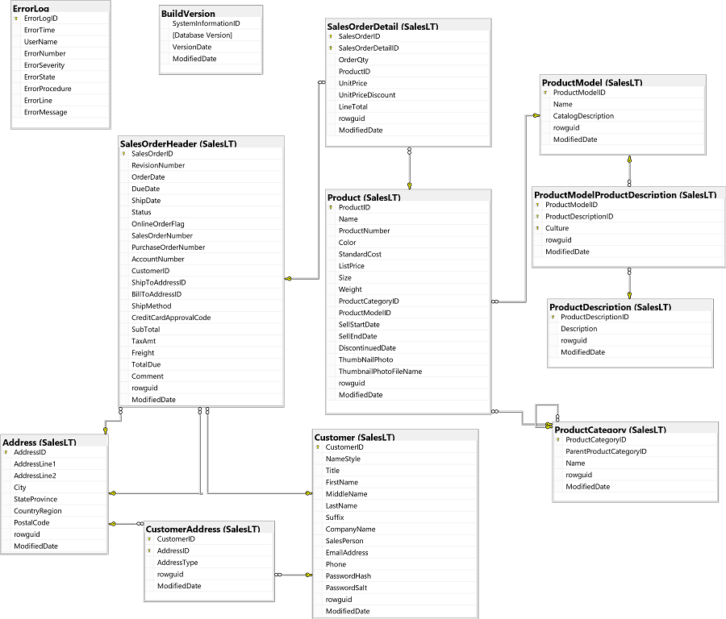

---
lab:
    title: 'Combine query results with set operators'
    module: 'Additional exercises'
---
# Combine query results with set operators

In this lab, you will use set operators to retrieve results from the **adventureworks** database. For your reference, the following diagram shows the tables in the database (you may need to resize the pane to see them clearly).

> **Note**: If you're familiar with the standard **AdventureWorks** sample database, you may notice that in this lab we are using a simplified version that makes it easier to focus on learning Snowflake SQL syntax.

## Write a query that uses the UNION operator

1. Create a new worksheet and connect to the database and warehouse.

1. In the query editor, enter the following code:

    ```
    SELECT CompanyName 
    FROM SalesLt.Customer  
    WHERE CustomerID BETWEEN 1 and 20000   
    UNION
        SELECT CompanyName 
        FROM SalesLt.Customer  
        WHERE CustomerID BETWEEN 20000 and 40000;
    ```

1. Highlight the SQL code and select **&#x23f5;Run**. Notice that the result set contains **CompanyNames** from both result sets.

## Write a query that uses the INTERSECT operator

Now let's try a query using the INTERSECT operator.

1. In the query editor, below the existing code, enter the following code:

    ```
    -- Prepare tables
    CREATE TEMPORARY TABLE SalesLT.t1
    (Name nvarchar(30) NOT NULL);
    CREATE TEMPORARY TABLE SalesLT.t2
    (Name nvarchar(30) NOT NULL);
    INSERT INTO SalesLT.t1 (Name)
        VALUES
            ('Daffodil'),
            ('Camembert'),
            ('Neddy'),
            ('Smudge'),
            ('Molly');
    INSERT INTO SalesLT.t2 (Name)
        VALUES
            ('Daffodil'),
            ('Neddy'),
            ('Molly'),
            ('Spooky');
    SELECT Name
    FROM SalesLT.t1
    INTERSECT
    SELECT Name
    FROM SalesLT.t2
        ORDER BY Name;
    ```

1. Highlight the code and select **&#x23f5;Run** to execute it. Notice that values in both **t1** and **t2** are returned.

## Write a query that uses the CROSS APPLY operator

Now you will write a table-valued function to return the product category and quantity ordered by specific customers. You will pass the **CustomerID** fom the select statement to the table-valued function in a CROSS APPLY statement.

1. In the query editor, enter the following code:

    ```
    CREATE OR REPLACE FUNCTION dbo.ProductSales (InputCustomerID NUMBER)
    RETURNS TABLE (Category NVARCHAR(50), Quantity INTEGER)
    AS   
    $$
    SELECT C.Name AS Category, SUM(D.OrderQty) AS Quantity
    FROM SalesLT.SalesOrderHeader AS H
    INNER JOIN SalesLT.SalesOrderDetail AS D
      ON H.SalesOrderID = D.SalesOrderID
    INNER JOIN SalesLT.Product AS P
      ON D.ProductID = P.ProductID
    INNER JOIN SalesLT.ProductCategory AS C
      ON P.ProductCategoryID = C.ProductCategoryID
    WHERE H.CustomerID = InputCustomerID
    GROUP BY C.Name
    $$;
    ```

1. Highlight the code and select **&#x23f5;Run** to execute it.

1. Then, enter the following code on a new line:

    ```
    SELECT C.CustomerID, C.CompanyName, P.Category, P.Quantity
    FROM SalesLT.Customer AS C
        CROSS JOIN TABLE(dbo.ProductSales(C.CustomerID)) AS P;
    ```

1. Highlight the code and select **&#x23f5;Run** to execute it.

## Challenges

Now it's your turn to use set operators.
> **Tip**: Try to determine the appropriate code for yourself. If you get stuck, suggested answers are provided at the end of this lab.

### Challenge 1: Return all company names

Amend the SQL code containing the UNION operator, to return ALL company names, including duplicates.

### Challenge 2: Return names from t1

Amend the SQL code containing the INTERSECT operator to return names from **t1** that do not appear in **t2**.

## Challenge Solutions

This section contains suggested solutions for the challenge queries.

### Challenge 1

```
SELECT CompanyName 
FROM SalesLt.Customer
WHERE CustomerID BETWEEN 1 and 20000 
UNION ALL
    SELECT CompanyName 
    FROM SalesLt.Customer
    WHERE CustomerID BETWEEN 20000 and 40000;
```

### Challenge 2

```
    CREATE OR REPLACE TEMPORARY TABLE SalesLT.t1
    (Name nvarchar(30) NOT NULL);
    CREATE OR REPLACE TEMPORARY TABLE SalesLT.t2
    (Name nvarchar(30) NOT NULL);
    INSERT INTO SalesLT.t1 (Name)
        VALUES
            ('Daffodil'),
            ('Camembert'),
            ('Neddy'),
            ('Smudge'),
            ('Molly');
    INSERT INTO SalesLT.t2 (Name)
        VALUES
            ('Daffodil'),
            ('Neddy'),
            ('Molly'),
            ('Spooky');
    SELECT Name
    FROM SalesLT.t1
    EXCEPT
    SELECT Name
    FROM SalesLT.t2
        ORDER BY Name;
```

## Volgende modules

De volgende module is [Additional exercises: Use window functions](./08-create-window-query-functions.md). Hieronder vind je een overzicht van alle modules:

1. [Get Started with Snowflake SQL](./01-get-started-with-snowflake-sql.md)
2. [Sort and Filter Query Results](./02-filter-sort.md)
3. [Query Multiple Tables with Joins](./03a-joins.md)
4. [Use Subqueries](./03b-subqueries.md)
5. [Use Built-in Functions](./04-built-in-functions.md)
6. [Modify Data](./05-modify-data.md)
7. [Create queries with table expressions](./06-use-table-expressions.md)
8. [Combine query results with set operators](./07-combine-query-results.md) (huidige module)
9. [Use window functions](./08-create-window-query-functions.md)
10. [Use pivoting and grouping sets](./09-transform-data.md)
11. [Introduction to programming with SQL](./10-program-with-sql.md)
12. [Create stored procedures in Snowflake SQL](./11-create-stored-procedures.md)
13. [Implement error handling with Snowflake SQL](./12-implement-error-handling.md)
14. [Implement transactions with Snowflake SQL](./13-implement-transitions-in-tsql.md)
