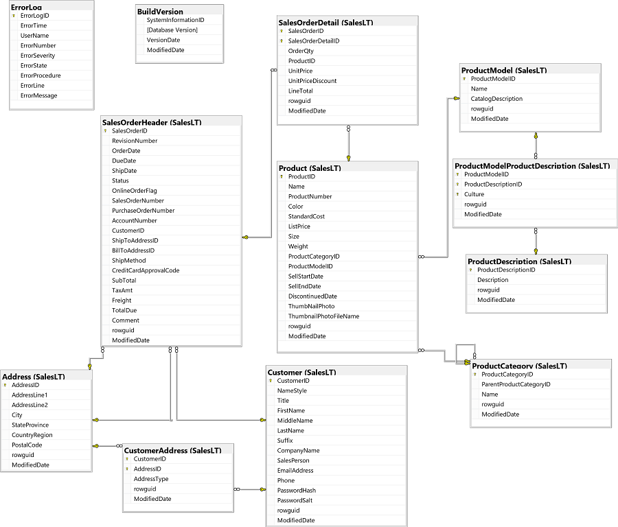

---
lab:
    title: 'Implement error handling with Snowflake SQL'
    module: 'Additional exercises'
---

# Implement error handling with Snowflake SQL

In this lab, you'll use Snowflake SQL statements to test various error handling techniques in the **adventureworks** database. For your reference, the following diagram shows the tables in the database (you may need to resize the pane to see them clearly).



> **Note**: If you're familiar with the standard **AdventureWorks** sample database, you may notice that in this lab we are using a simplified version that makes it easier to focus on learning Snowflake SQL syntax.

## Use TRY_<conversion function> to prevent a conversion error

1. Create a new worksheet and connect to the database and warehouse.
1. In the worksheet, type the following SQL code:

    ```
    SELECT CAST('Some text' AS int);
    ```

1. Select **&#x23f5;Run** to run the code.
1. Notice the conversion error:

    | Result|
    |-------|
    | Numeric value 'Some text' is not recognized |

1. Add **TRY_** to the **CAST** function. Your SQL code should look like this:

    ```
    SELECT TRY_CAST('Some text' AS int);
    ```

1. Run the modified code, and review the response. The result should include a row with a **null** value, indicating the casting was unsuccessful.

## Declare and raise your own exception

1. Replace the code in your worksheet with the following SQL code:

    ```
    EXECUTE IMMEDIATE 
    $$
    DECLARE
      my_exception EXCEPTION (-20002, 'Raised MY_EXCEPTION.');
      integer_variable INT;
    BEGIN
      SELECT TRY_TO_NUMBER('Some text') INTO :integer_variable;
      IF (integer_variable IS NULL) THEN
        RAISE my_exception;
      END IF;
      RETURN integer_variable;
    END;
    $$
    ;
    ```

1. Select **&#x23f5;Run**. Notice that you get an error message containing your own error code and message.

## Construct your own error message object

1. Extend the SQL code you used previously so it looks like this:

    ```
    EXECUTE IMMEDIATE 
    $$
    DECLARE
      my_exception EXCEPTION (-20002, 'Raised MY_EXCEPTION.');
      integer_variable INT;
    BEGIN
      SELECT TRY_TO_NUMBER('Some text') INTO :integer_variable;
      IF (integer_variable IS NULL) THEN
        RAISE my_exception;
      END IF;
      RETURN integer_variable;
    EXCEPTION
      WHEN my_exception THEN
        RETURN OBJECT_CONSTRUCT('Error type', 'MY_EXCEPTION',
                                'SQLCODE', sqlcode,
                                'SQLERRM', sqlerrm,
                                'SQLSTATE', sqlstate);
    END;
    $$
    ;
    ```

1. Run the modified code.  You'll see that message returned now contains more information:

    | anonymous block|
    | ------ |
    | {   "Error type": "MY_EXCEPTION",   "SQLCODE": -20002,   "SQLERRM": "Raised MY_EXCEPTION.",   "SQLSTATE": "P0001" } |

## Create a stored procedure to display an error message

1. Enter the following SQL code:

    ```
    CREATE OR REPLACE PROCEDURE dbo.GetErrorInfo (code int, message NVARCHAR(200), state NVARCHAR(5))
    RETURNS OBJECT
    LANGUAGE SQL
    AS
    $$
    BEGIN
        RETURN OBJECT_CONSTRUCT('Error type', 'EXCEPTION',
                            'SQLCODE', code,
                            'SQLERRM', message,
                            'SQLSTATE', state);
    END;
    $$
    ```

1. Select **&#x23f5;Run**. to run the code, which creates a stored procedure named **dbo.GetErrorInfo**.
1. Return to the query that previously resulted in a your custom error, and modify it as follows:

    ```
EXECUTE IMMEDIATE 
$$
DECLARE
  my_exception EXCEPTION (-20002, 'Raised MY_EXCEPTION.');
  integer_variable INT;
BEGIN
  SELECT TRY_TO_NUMBER('Some text') INTO :integer_variable;
  IF (integer_variable IS NULL) THEN
    RAISE my_exception;
  END IF;
  RETURN integer_variable;
EXCEPTION
  WHEN my_exception THEN
    BEGIN
        LET rs RESULTSET;
        LET statement VARCHAR := 'CALL dbo.GetErrorInfo(' || sqlcode || ',\'' || sqlerrm  || '\',\'' || sqlstate || '\')'; 
        rs := (EXECUTE IMMEDIATE :statement);
        RETURN table(rs);
    END;
END;
$$
;
    ```

1. Run the code.  This will trigger the stored procedure and display:

    | GetErrorInfo |
    | ------ |
    | {   "Error type": "EXCEPTION",   "SQLCODE": -20002,   "SQLERRM": "Raised MY_EXCEPTION.",   "SQLSTATE": "P0001" }|

## Add an Error Handling Routine

1. Modify your code to look like this:

    ```
    EXECUTE IMMEDIATE 
    $$
    DECLARE
      my_exception EXCEPTION (-20002, 'Raised MY_EXCEPTION.');
      integer_variable INT;
    BEGIN
      SELECT TRY_TO_NUMBER('1') INTO :integer_variable;
      IF (integer_variable IS NULL) THEN
        RAISE my_exception;
      END IF;
      LET other_error := 1/0;
      RETURN integer_variable;
    EXCEPTION
      WHEN my_exception THEN
        BEGIN
            LET rs RESULTSET;
            LET statement VARCHAR := 'CALL dbo.GetErrorInfo(' || sqlcode || ',\'' || sqlerrm  || '\',\'' || sqlstate || '\')'; 
            rs := (EXECUTE IMMEDIATE :statement);
            RETURN table(rs);
        END;
      WHEN OTHER THEN
        BEGIN
            LET rs RESULTSET;
            LET statement VARCHAR := 'CALL dbo.GetErrorInfo(' || sqlcode || ',\'' || sqlerrm  || '\',\'' || sqlstate || '\')'; 
            rs := (EXECUTE IMMEDIATE :statement);
            RETURN table(rs);
        END;
    END;
    $$
    ;
    ```

1. Run the modified code. The text fed to the TRY_TO_NUMBER function is valid now, so your custom exception is not raised. Another error is added though, and handled in the OTHER exception block. It executes the stored procedure to display the error.

    |  GetErrorInfo |
    | ------ |
    | {   "Error type": "EXCEPTION",   "SQLCODE": 100051,   "SQLERRM": "Division by zero",   "SQLSTATE": "22012" }|

## Challenges

Now it's time to try using what you've learned.

> **Tip**: Try to determine the appropriate solutions for yourself. If you get stuck, suggested answers are provided at the end of this lab.

### Challenge 1: Create a simple error display procedure

Error messages and error handling are essential for good code. Your manager has asked you to develop a common error display procedure.  Use this sample code as your base.

```
EXECUTE IMMEDIATE 
$$
BEGIN
    LET num := 'Challenge 2';
    LET result_string := 'Casting: ' || num::DECIMAL(10,4);
    RETURN result_string;
END;
$$
;
```

1. Catch the error
   - Declare and raise an exception.
2. Create a stored procedure
   - Create a stored procedure called dbo.DisplayErrorDetails.  It should display a title and the value for **sqlcode**, **sqlerrm** and **sqlstate**.
3. Display the error information
   - Use the stored procedure to display the error information when an error occurs.

## Challenge Solutions

This section contains suggested solutions for the challenge queries.

### Challenge 1

1. Catch the error

```
DECLARE @customerID AS INT = 30110;
DECLARE @fname AS NVARCHAR(20);
DECLARE @lname AS NVARCHAR(30);
DECLARE @maxReturns AS INT = 1;

WHILE @maxReturns <= 10
BEGIN
    BEGIN TRY
        SELECT @fname = FirstName, @lname = LastName FROM SalesLT.Customer
            WHERE CustomerID = @CustomerID;

        PRINT CAST(@customerID as NVARCHAR(20)) + N' ' + @fname + N' ' + @lname;
    END TRY
    BEGIN CATCH

    END CATCH;

    SET @maxReturns += 1;
    SET @CustomerID += 1;
END;
```

2. Warn the user that an error has occurred

```
DECLARE @customerID AS INT = 30110;
DECLARE @fname AS NVARCHAR(20);
DECLARE @lname AS NVARCHAR(30);
DECLARE @maxReturns AS INT = 1;

WHILE @maxReturns <= 10
BEGIN
    BEGIN TRY
        SELECT @fname = FirstName, @lname = LastName FROM SalesLT.Customer
            WHERE CustomerID = @CustomerID;

            PRINT CAST(@customerID as NVARCHAR(20)) + N' ' + @fname + N' ' + @lname;
    END TRY
    BEGIN CATCH
        PRINT 'Unable to run query'
    END CATCH;

    SET @maxReturns += 1;
    SET @CustomerID += 1;
END;
```

3. Only display valid customer records

```
DECLARE @customerID AS INT = 30110;
DECLARE @fname AS NVARCHAR(20);
DECLARE @lname AS NVARCHAR(30);
DECLARE @maxReturns AS INT = 1;

WHILE @maxReturns <= 10
BEGIN
    BEGIN TRY
        SELECT @fname = FirstName, @lname = LastName FROM SalesLT.Customer
            WHERE CustomerID = @CustomerID;

        IF @@ROWCOUNT > 0 
        BEGIN
            PRINT CAST(@customerID as NVARCHAR(20)) + N' ' + @fname + N' ' + @lname;
        END
    END TRY
    BEGIN CATCH
        PRINT 'Unable to run query'
    END CATCH

    SET @maxReturns += 1;
    SET @CustomerID += 1;
END;
```

### Challenge 2

1. Catch the error

```
EXECUTE IMMEDIATE 
$$
DECLARE
    my_exception EXCEPTION (-20002, 'Raised MY_EXCEPTION');
    decimal_variable DECIMAL(10,4);
BEGIN
    decimal_variable := (SELECT TRY_TO_DECIMAL('Challenge 2', 10,4));
    IF (decimal_variable IS NULL) THEN
        RAISE my_exception;
    END IF;
    LET result_string := 'Casting: ' || decimal_variable;
    RETURN result_string;
END;
$$
;
```

2. Create a stored procedure

```
CREATE OR REPLACE PROCEDURE dbo.DisplayErrorDetails (code int, message NVARCHAR(200), state NVARCHAR(5))
RETURNS OBJECT
LANGUAGE SQL
AS
$$
BEGIN
    RETURN OBJECT_CONSTRUCT('SQLCODE', code,
                        'SQLERRM', message,
                        'SQLSTATE', state);
END;
$$
```

3. Display the error information

```
EXECUTE IMMEDIATE 
$$
DECLARE
    my_exception EXCEPTION (-20002, 'Raised MY_EXCEPTION');
    decimal_variable DECIMAL(10,4);
BEGIN
    decimal_variable := (SELECT TRY_TO_DECIMAL('Challenge 2', 10,4));
    IF (decimal_variable IS NULL) THEN
        RAISE my_exception;
    END IF;
    LET result_string := 'Casting: ' || decimal_variable;
    RETURN result_string;
EXCEPTION
    WHEN my_exception THEN
    BEGIN
        LET rs RESULTSET;
        LET statement VARCHAR := 'CALL dbo.DisplayErrorDetails(' || sqlcode || ',\'' || sqlerrm  || '\',\'' || sqlstate || '\')'; 
        rs := (EXECUTE IMMEDIATE :statement);
        RETURN table(rs);
    END;
END;
$$
;
```

## Volgende modules

De volgende module is [Additional exercises: Implement transactions with Snowflake SQL](./13-implement-transitions-in-tsql.md). Hieronder vind je een overzicht van alle modules:

1. [Get Started with Snowflake SQL](./01-get-started-with-snowflake-sql.md)
2. [Sort and Filter Query Results](./02-filter-sort.md)
3. [Query Multiple Tables with Joins](./03a-joins.md)
4. [Use Subqueries](./03b-subqueries.md)
5. [Use Built-in Functions](./04-built-in-functions.md)
6. [Modify Data](./05-modify-data.md)
7. [Create queries with table expressions](./06-use-table-expressions.md)
8. [Combine query results with set operators](./07-combine-query-results.md)
9. [Use window functions](./08-create-window-query-functions.md)
10. [Use pivoting and grouping sets](./09-transform-data.md)
11. [Introduction to programming with SQL](./10-program-with-sql.md)
12. [Create stored procedures in Snowflake SQL](./11-create-stored-procedures.md)
13. [Implement error handling with Snowflake SQL](./12-implement-error-handling.md) (huidige module)
14. [Implement transactions with Snowflake SQL](./13-implement-transitions-in-tsql.md)
